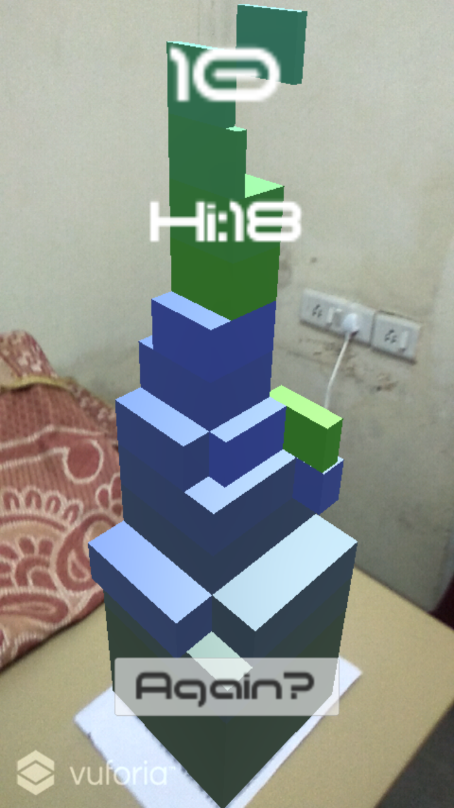

# Stack
This is an AR clone of the well known "Stack" game on Android.

I have developed it with help of vuforia plugin and is supported by all android and ios platforms which vuforia supports. Here we take help of image detection by which our game is shown in AR mode.

It's a pretty basic implementation, but the code is all here for anyone else to reference.

## Menu

## Playing

## Game over

# References
- **Font:** nimavisual-moonhouse [http://www.fontspace.com/nimavisual/moonhouse](http://www.fontspace.com/nimavisual/moonhouse)
- **Skybox:** [https://www.assetstore.unity3d.com/en/#!/publisher/4555](https://www.assetstore.unity3d.com/en/#!/publisher/4555)
